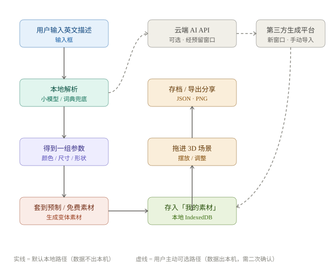
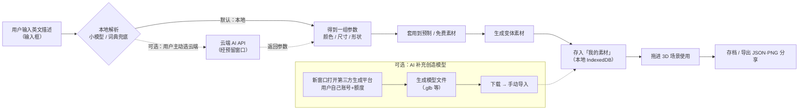

# WordWorld 技术设计文档（TECH_DESIGN.md）

> 本文档是 Week 1 · Day 5 的交付物：回答「数据从哪来、到哪去」，并给出本期 MVP 的完整技术路线。
> 上游依据：`PRD.md`（功能与验收）、`research.md`（方向）与课程 28 天总览。本文档不写代码，只做技术选型与数据流说明。

---

## 0. 一句话说清数据流（今日目标）

> **本期 MVP：用户输入的英文描述，在浏览器本地被解析成一组参数 → 套用到预制/免费素材上生成变体 → 存入本地素材库与存档 → 可导出分享；云端 AI 算力只在用户主动选择时经预留窗口调用，其余数据不出本机。**

---

## 1. 前后端与数据库分工

### 1.1 三层是什么

| 层 | 大白话 | 传统网页里它在哪 |
|---|---|---|
| **前端（Frontend）** | 你看到、点到的一切：按钮、输入框、3D 场景 | 用户的浏览器里 |
| **后端（Backend）** | 界面背后「看不见的服务器」，负责算账、存数据、校验 | 远方的服务器 |
| **数据库（Database）** | 专门「长期存数据」的仓库，关掉网页数据也不丢 | 通常在服务器上 |

### 1.2 WordWorld 的三层分工

口径（用户 Day 5 确认）：**本期 MVP 里后端和数据库已经存在（骨架），并预留 AI 算力窗口**——这与课程 28 天总览一致：Week 3（Day 15–21）正式「打通云端链路、建云端数据库、部署公网」，Week 4 上线验收。

| 层 | 本期 MVP 定位 | 具体承担什么 |
|---|---|---|
| **前端** | ✅ 主战场 | 3D 场景渲染、拖拽交互、英文输入框、素材面板、导出入口 |
| **后端** | ✅ 已有骨架（W3 成型） | AI 算力转发、作品同步；W1–W2 多数逻辑在前端本地完成 |
| **数据库** | ✅ 已有（W3 成型） | 本期用户作品默认落浏览器本地（IndexedDB），数据库骨架为多端同步预留 |
| **AI 算力** | 🪟 预留窗口 | 接口先留好，本期走「本地小模型 + 词典 + 可选云端」；后期可无痛切换 |

### 1.3 演进路线：本期 vs 后期

| 层 | 本期 MVP（Day 5～28） | 后期完整版 |
|---|---|---|
| 前端 | 浏览器内（React + Three.js） | 继续扩展 |
| 后端 | 已有骨架，最小可用 | 完整后端服务（同步、账号体系等） |
| 数据库 | 本地 IndexedDB 为主，数据库骨架预留 | 云端数据库（多端同步） |
| AI 算力 | 本地小模型 + 词典 + 可选云端 API | 云端/服务端 AI 算力，经预留窗口接通 |

> 设计原则：本期所有「数据出本机」的路径都做成**可选、用户主动触发**，默认不联网也能完整使用。

---

## 2. 技术路线（D1～D4 定稿）

> 输入是 PRD §13.2 的四个待定项。每项给出「选了什么 + 为什么 + 代价」。

### D1 — 本地 AI 模型选型与体量

- **选择**：C 混合方案 —— 本地小语言模型（WebGPU 量化）+ 词典模板兜底。
- **为什么**：PRD 定位 AI 只「把英文描述解析成参数（颜色/尺寸/形状）」，不生成图片、不生成 3D 模型，因此只需一个「能听懂英文、吐 JSON」的小模型，浏览器可跑。词典兜底用于「未下载模型时也能完整玩一遍」（PRD AC-25）。
- **代价**：混合方案实现最复杂；本地小模型首次下载约 1–2GB，需设备支持 WebGPU；未下载模型时能力受限（只认预设词）。
- ⏳ **待回填**：具体模型型号与体量（候选：Llama 3.2 1B/3B、Qwen 2.5 1.5B 等 WebLLM 支持的量化模型）待实测下载时间与解析质量后定，预计 Week 2 初回填。

### D2 — 不下载模型时的「替代算力路径」

- **选择**：C 混合方案 —— 本地词典为主 + 云端 API 可选（即「A 为主 + B 留窗口」）。
- **为什么**：默认走本地词典，数据不出本机（契合「核心体验在本机完成」）；用户**主动选择**云端时才经预留窗口调用云端大模型 API。
- **代价**：引入「云端可选」后，隐私边界需明确说明（见 §4.3）；需处理云端密钥与调用成本；本期以本地词典为默认、云端作为可选增强。
- **AC-26 已回填**（见 §4.2，D2 定稿后的必做回填，PRD v2.3）。

### D3 — 3D 渲染库与前端框架版本

- **选择**：**Three.js**（3D 渲染）+ **React**（前端框架）+ **Vite**（构建工具）。
- **为什么**：Three.js 是浏览器 3D 事实标准，教程最多、社区最大（适合零基础）；React 与 PRD 借鉴的 AI Town 技术栈一致，28 天内加功能更快；Vite 是 React 生态标配、启动与热更新最快。
- **代价**：Three.js 与 React 均有学习曲线；Three.js 需手动管理场景/相机/渲染循环。

### D4 — 预制 3D 素材来源与授权

- **选择**：A 轻量版 —— **预设模型 + 免费素材库 + AI 补充（新窗口生成 → 手动导入）**。
- **为什么**：
  1. 预设模型（内置预制库）与免费素材库（免版权）作为前两层，覆盖绝大多数需求，接上 D1/D2 的「词典兜底」逻辑；
  2. 「AI 补充」用**新窗口打开第三方生成平台**，用户用**自己账号 + 自己额度**生成模型 → 下载文件 → 经 WordWorld「导入模型」入口手动导入。这样绕开了「iframe 内嵌被第三方拒绝」「登录态跨 iframe 不互通」两大不可控风险；
  3. 用「用户自己的账号和额度」，产品零成本、零密钥管理、零合规负担。
- **代价**：用户多一步「手动导入」；需逐个核对免版权素材的授权条款（优先 CC0）；用户自生成模型的版权/可复用性取决于第三方平台条款。

---

## 3. 算力方案对比与推荐（方案 A vs 方案 B）

> 用户 Day 5 定义：**方案 A = 本地小模型；方案 B = 云端 API**。以下为四维对比与推荐结论。

### 3.1 四维对比

| 维度 | 方案 A：本地小模型 | 方案 B：云端 API |
|---|---|---|
| **学习成本** | 较高：要学 WebLLM/WebGPU 集成、模型加载与显存管理，首次集成约 2–3 天 | 低：标准 HTTP 调用，半天–1 天跑通 |
| **线上持久化** | 数据天然在本机（IndexedDB），换设备不带走；跨设备同步要等 Week 3 云数据库 | 数据经云端，天然配合 Week 3 云数据库做跨设备同步；但隐私边界变化 |
| **费用** | 运行 ¥0（用自己的 GPU 与电），一次性下载 1–2GB | 按 token 计费（demo 用量每月约几元–几十元）；需注册平台账号、管理 API Key |
| **排错难度** | 较高：浏览器 GPU 兼容、显存不足、模型加载失败，报错晦涩 | 较低：标准 HTTP 状态码与日志；但多一层网络/第三方依赖 |

### 3.2 对照本项目限制

| 限制 | 方案 A | 方案 B |
|---|---|---|
| 电脑：联想拯救者 Y9000P ARX8（独显 RTX 40 系，支持 WebGPU） | ✅ 硬件门槛不存在 | ✅ 无要求 |
| 时间：28 天（W3 才上后端） | ⚠️ 多花约 2 天，落在 W1–W2 可消化 | ✅ 最快 |
| 账号/费用：WorkBuddy 积分、服务器价格敏感 | ✅ 零 API 费用、零账号 | ⚠️ 持续费用 + 注册管理账号 |

### 3.3 推荐结论：**A 为主 + B 留窗口**

1. Y9000P 跑得动，方案 A 最大的硬件门槛对本项目不成立；
2. 零运行费，匹配「积分/服务器价格」成本约束；
3. PRD 核心承诺「核心体验在本机完成、数据默认不出本机」只有 A 能兑现；
4. A 多花的 2 天在 W1–W2 消化，W3 反正要搭后端，届时再接 B 也顺；
5. B 不是不做——窗口已预留（§7 API-9），用户主动选才走云端，后期可无痛切换。

### 3.4 验收基准设备（PRD §12.0 要求 Day 5 记录）

- **机型**：联想拯救者 Y9000P ARX8（AMD 版，独立 NVIDIA RTX 40 系显卡；具体型号以设备管理器为准，首次性能验收前回填）。
- **含义**：PRD 所有涉及速度、帧率的验收标准（如 AC-22 的 10 秒、AC-19 的 20 FPS）都在这台机器上测量。

---

## 4. 数据流（从哪来、到哪去）

### 4.1 核心数据流图

> 下图是「静态版」，可直接查看/截图；Markdown 预览器若支持 Mermaid，也可看下方源码版（内容一致）。



<details>
<summary>Mermaid 源码（等价图，供支持 Mermaid 的预览器渲染）</summary>



</details>

### 4.2 AC-26 回填（D2 定稿后必做，已完成）

> 对应 PRD §12.5 的 AC-26（PRD v2.3 已回填）。

- **AC-26（回填）**「不下载模型时，替代算力路径可用」的验证步骤：
  1. 未下载本地模型时，输入一段**词典可识别的英文描述**（如 `a red tree`），提交后 **10 秒内**返回变体，且数据**未离开本机**（断网状态下仍可完成）；
  2. 输入一段**词典无法识别的描述**（超出预设词），界面给出「基础模式」说明，并显示「可选云端生成」入口，不报错、不白屏；
  3. 用户主动点击「云端生成」入口时，弹出隐私提示「该操作会将描述发送至云端」，用户确认后才发起请求，返回结果同样进入「我的素材」。

### 4.3 数据「出本机」的唯一情形

本期默认**数据不出本机**；让数据离开本机的情形只有两类，均为**用户主动、明确选择**：
1. **D2 可选云端**：用户主动点「云端生成」→ 英文描述发送至云端 API；
2. **D4 第三方生成平台**：用户自己在新窗口登录第三方平台生成模型（数据在第三方平台内，不经过 WordWorld）。

两条路径都需在界面上提前告知用户，且需用户二次确认。Week 3 接入云数据库后，「作品同步」将成为第三类出本机情形，届时同步更新本节与隐私说明。

---

## 5. 项目结构

> 按「数据访问层独立」设计：W1–W2 本地实现，W3 换 HTTP 实现时**只换 `src/data/` 里的实现，不动 UI**（对应课程 W3「数据访问层拆分」）。

```
vibe-coding-workspace/
├── index.html                  # 入口页
├── package.json / vite.config.js
├── public/
│   └── assets/models/          # 预制 3D 模型（.glb，CC0/免版权）
├── src/
│   ├── main.jsx / App.jsx      # React 入口
│   ├── components/             # UI 组件（输入框、素材面板、顶栏、帮助页）
│   ├── scenes/                 # Three.js 场景封装（与 React 解耦）
│   ├── data/                   # ★ 数据访问层（接口契约在这里兑现）
│   │   ├── local/              # W1–W2：IndexedDB 实现
│   │   ├── remote/             # W3：HTTP API 实现（骨架先留）
│   │   └── index.js            # 统一出口：UI 只从这里调接口
│   ├── ai/                     # ★ AI 算力窗口
│   │   ├── dictionary.js       # 词典兜底（默认可用）
│   │   ├── local-llm.js        # 方案 A：WebLLM + WebGPU（下载后启用）
│   │   └── cloud.js            # 方案 B 窗口：云端 API（默认关闭）
│   └── styles/
├── dataflow.svg                # 数据流图（本文件 §4 引用）
├── TECH_DESIGN.md / PRD.md / research.md / AGENTS.md
└── .env                        # 本地环境变量（.gitignore 已挡，永不提交）
```

---

## 6. 数据对象及字段

> 字段定义**完全沿用 PRD §7**，此处只补「存在哪里」。本期用 IndexedDB（浏览器本地库），建 4 个对象仓库（object store）。

| 对象（PRD 出处） | 核心字段 | 存储位置 |
|---|---|---|
| **场景物体**（§7.1） | 物体 ID、素材 ID、位置、旋转、缩放 | IndexedDB → `sceneObjects` |
| **素材**（§7.2） | 素材 ID、英文名、类别、来源（预制/AI 生成）、变体参数 | IndexedDB → `assets`；预制素材文件本体在 `public/assets/models/` |
| **生成记录**（§7.3） | 英文原文、提交时间、结果状态（含失败原因）、生成素材 ID | IndexedDB → `generationRecords` |
| **存档元数据**（§7.4） | 存档版本号、最后保存时间、物体数量、占用空间估算 | IndexedDB → `saveMeta` |

- **导出文件（JSON）** = PRD §7.5：存档元数据 + 全部物体记录 + 用到的素材定义（含自制）。
- **版本迁移**：每个对象仓库带 `schemaVersion`，字段变更时写升级函数（见 §10.3）。

---

## 7. API 列表（接口契约先行）

> 写法：只定义**输入 → 输出 → 错误码**，不绑定实现。W1–W2 用 `src/data/` 内的本地函数实现；W3 把需要服务端的换成 HTTP，**调用方式与文档不变**。错误码对应 PRD §8 异常清单 E1–E8。

| # | 接口 | 输入 | 输出 | 错误码 | 实现阶段 |
|---|---|---|---|---|---|
| API-1 | 解析英文描述 | 英文文本 | 变体参数（颜色/尺寸/形状）或失败原因 | E3 超时 / E4 解析失败 / E5 基础模式 | W1–W2 本地（词典 → 小模型） |
| API-2 | 生成变体素材 | 变体参数 + 原素材 ID | 新素材记录（自动进「我的素材」） | 继承 API-1 | W1–W2 本地 |
| API-3 | 保存场景 | 全部物体记录 | 保存结果（含占用空间估算） | E6 存档损坏 / E8 空间不足 | W1–W2 本地；**W3 可换 HTTP + 云数据库** |
| API-4 | 读取存档 | 无 | 存档元数据 + 全部物体记录 | E6 | W1–W2 本地；**W3 可换 HTTP** |
| API-5 | 导出 JSON | 当前场景 + 用到的素材 | JSON 文件 | — | W1–W2 本地 |
| API-6 | 导入 JSON | JSON 文件 | 还原后的场景 | E7 非法/版本不匹配 | W1–W2 本地 |
| API-7 | 导出 PNG | 当前视角 | PNG 文件 | — | W1–W2 本地 |
| API-8 | 素材库列表 | 类别（可选） | 素材记录数组 | E2 加载失败 | W1–W2 本地 |
| API-9 | 云端生成（预留窗口） | 英文文本 | 变体参数 | 网络/超时/密钥错误 | **默认关闭**；W3+ 经后端转发启用 |

> 关键点：API-9 的密钥**绝不能放进前端**（浏览器代码对用户可见），必须由后端转发——这也是把云端启用排到 W3（有后端之后）的硬理由。

---

## 8. 错误处理

> 原则沿用 PRD §8：**不白屏、不静默吞掉、中文提示、失败时保留用户输入**。此处补技术分层的处理方式。

| 层 | 谁负责 | 处理方式 |
|---|---|---|
| **UI 层** | React 组件 | 统一错误提示组件：中文原因 + 恢复动作按钮；输入框内容在任何失败下都不清空 |
| **AI 层** | `src/ai/` | 超时 10 秒（AC-22）→ E3；模型输出解析失败 → E4；未下载模型 → E5 基础模式 + 替代路径入口；WebGPU 不支持 → E1 场景照常可用 |
| **数据层** | `src/data/` | 存储写入失败重试 1 次，仍失败 → E8（含空间清理指引）；读档解析失败 → E6 提供「清空重开」；导入校验失败 → E7 指明哪里不对 |
| **网络层（W3+）** | `src/data/remote/` | HTTP 状态码映射为 E 系错误码；云端调用前必须经用户二次确认（§4.3） |

---

## 9. 环境变量

> 本期（W1–W2）**几乎不需要环境变量**：无后端、无密钥。以下为预留规范，避免以后乱放。

| 变量名 | 用途 | 现在是否需要 |
|---|---|---|
| `VITE_CLOUD_AI_ENABLED` | 方案 B 云端生成开关（默认 `false`） | 否（W3+ 启用） |
| `VITE_CLOUD_AI_ENDPOINT` | 云端 API 地址（经后端转发，非直连） | 否（W3+） |
| `VITE_SYNC_ENDPOINT` | W3 云数据库同步地址 | 否（W3） |

规则：
1. 本地放 `.env`（**.gitignore 已挡，永不提交**——AGENTS.md 第 5.3 条与现有 `.gitignore` 均已覆盖）；
2. Vite 要求前端变量以 `VITE_` 前缀才会暴露，但**密钥类一律不放进 `VITE_` 变量**（浏览器代码用户可见）；
3. 将来云端 API Key 只存后端环境（服务器环境变量），前端永远不接触。

---

## 10. 部署与迁移注意事项

### 10.1 阶段部署路线（对齐课程 28 天总览）

| 阶段 | 部署形态 | 费用取向 |
|---|---|---|
| W1–W2 | 本地开发（Vite dev server）；可选静态托管（GitHub Pages / Vercel 免费层） | 免费层优先 |
| W3 | 后端 + 云数据库上公网（平台待定，⏳ 按课程 W3 指引选，免费层优先） | 免费层优先 |
| W4 | 上线 v1.0 + 回滚演练 + 第三方试用 | 免费层优先 |

### 10.2 跨域（CORS）

W3 前后端分离部署后，浏览器会拦截跨域请求：需在后端配置 CORS 响应头，或用同域反向代理。此项已列入课程 W3「部署到公网并处理跨域」。

### 10.3 本地数据迁移

- 所有 IndexedDB 对象仓库带 `schemaVersion`（对应 PRD §7.4「存档版本号」）；
- 字段结构变更时写**升级函数**：老存档打开时自动升级，不丢数据；
- 导出 JSON 校验版本号：不匹配走 E7 提示，不静默失败。

### 10.4 大文件与兼容

- **本地模型（1–2GB）**：用浏览器 Cache API 缓存，支持用户随时删除（PRD R2 承诺）；下载前显示体积提示；
- **WebGPU 兼容**：打开页面即检测，不支持走 E1 降级（场景与预制素材照常可用）；
- **3D 模型文件（.glb）**：部署时开启 gzip/brotli 与长缓存头；公网部署时在下载入口标注总体积。

### 10.5 回滚

W4 课程要求「发布 v1.0 与回滚演练」：线上保持「上一版本可立即切回」；git 侧用 `git revert`（AGENTS.md 第 7.1 条，禁止 reset --hard 与强推）。

---

## 11. 变更记录

| 日期 | 版本 | 变更内容 | 原因 |
|---|---|---|---|
| 2026-09-20 | v1.0 | 首版：前后端分工、D1～D4 技术路线定稿、数据流图、AC-26 回填 | Week 1 · Day 5 任务 |
| 2026-09-20 | v1.1 | 按课程「今日实操」补全：算力方案 A/B 四维对比与推荐（A 为主 + B 留窗口）、验收基准设备（Y9000P ARX8）、项目结构、数据对象及字段、API 列表（接口契约先行）、错误处理、环境变量、部署与迁移注意事项 | Day 5 实操要求 + 用户三项拍板 |
